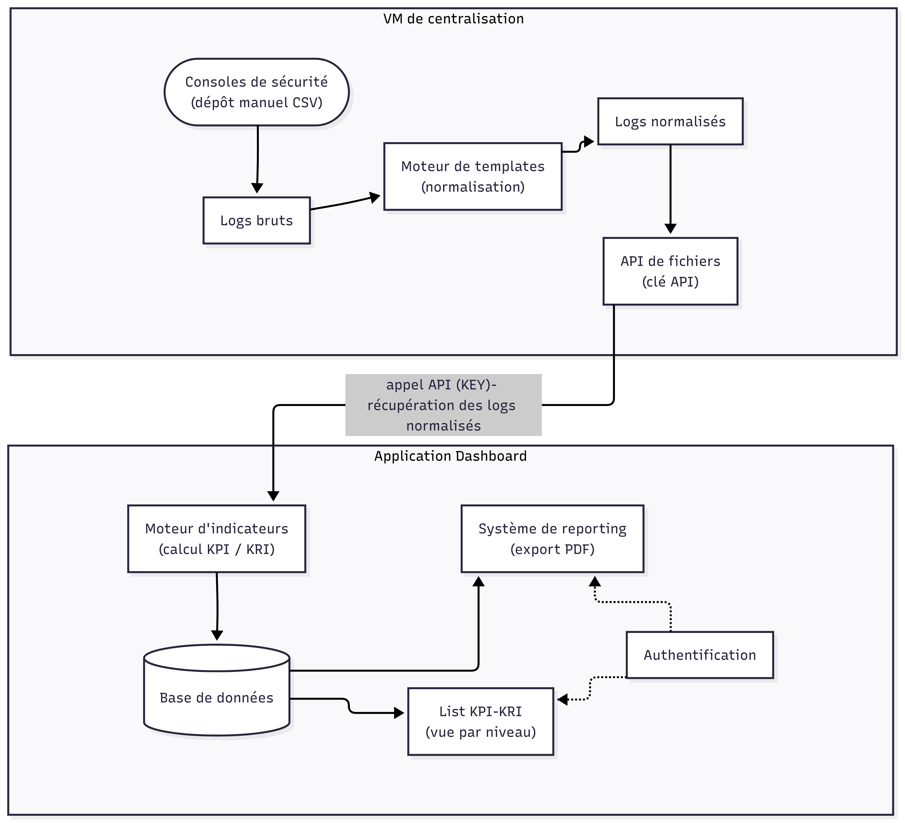

# 📊 KPI/KRI Dashboard — ONEE Cybersecurity

**Plateforme de pilotage des indicateurs de performance et de risque cyber**

---

## 📋 Table des matières

- [Présentation](#-présentation)
- [Fonctionnalités](#-fonctionnalités)
- [Architecture](#-architecture)
- [Prérequis](#-prérequis)
- [Installation](#-installation)
- [Configuration](#-configuration)
- [Utilisation](#-utilisation)
- [Modèles](#-modèles)
- [Sécurité](#-sécurité)
- [Déploiement](#-déploiement)
- [Licence](#-licence)

---

## 🎯 Présentation

Le **KPI/KRI Dashboard** est une application web Django développée pour l'**Office National de l'Électricité et de l'Eau Potable (ONEE)** dans le cadre de la Direction Cybersécurité. Elle permet de :

- **Piloter** les indicateurs de performance (KPI) et de risque (KRI) cyber
- **Suivre** l'évolution des mesures dans le temps
- **Générer** des rapports professionnels (PDF, DOCX, JSON)
- **Gérer** les utilisateurs avec différents niveaux d'accès
- **Sécuriser** l'accès avec l'authentification à deux facteurs (MFA/TOTP)

---

## 🔄 Flux de Données



## ✨ Fonctionnalités

### 🔐 Authentification & Sécurité

- Authentification par session Django
- **Authentification à deux facteurs (MFA/TOTP)** avec QR code
- Gestion des rôles et permissions (N2, N1, N, N0)
- Protection contre les attaques par force brute (rate limiting)

### 📊 Gestion des Indicateurs

- **KPI** (Key Performance Indicators) — Indicateurs de performance
- **KRI** (Key Risk Indicators) — Indicateurs de risque
- 4 niveaux hiérarchiques :
  - **N2** : Stratégique (N+2)
  - **N1** : Tactique (N+1)
  - **N** : Opérationnel (N)
  - **N0** : Technique (Niveau 1)
- Association aux solutions techniques (Firewall, EDR, VPN, MFA, WAF, PAM, etc.)

### 📈 Tableaux de bord

- Vue consolidée pour les superutilisateurs
- Vue filtrée par niveau pour les utilisateurs standards
- Cartes d'indicateurs avec statut visuel (couleurs)
- Barres de progression et tendances

### 📄 Module de Reporting

- **Génération de rapports périodiques au format PDF**
- **Export des indicateurs sur une période donnée**
- Filtres : type, niveau, solution, période
- Formats supportés : PDF, DOCX, JSON

### 👤 Gestion du Profil

- Modification des informations personnelles
- Changement de mot de passe
- Activation/désactivation du MFA

### ⚙️ Administration

- Gestion complète des utilisateurs (superutilisateur uniquement)
- Création/modification/suppression d'utilisateurs
- Attribution des rôles et niveaux d'accès

---

## 🏗️ Architecture

### Stack Technique

| Composant           | Technologie               |
| ------------------- | ------------------------- |
| **Backend**         | Django 5.x                |
| **Langage**         | Python 3.14+              |
| **Base de données** | PostgreSQL 18+            |
| **Frontend**        | HTML5, CSS3, JavaScript   |
| **MFA**             | django-otp, pyotp, qrcode |
| **PDF**             | WeasyPrint                |
| **Serveur**         | Gunicorn + Nginx          |

---

## 📋 Prérequis

- **OS** : Linux (Ubuntu 22.04+), macOS, ou Windows avec WSL2
- **Python** : 3.10+
- **PostgreSQL** : 14+
- **Redis** : 6+ (optionnel)
- **Nginx** : 1.18+ (production)

---

## 🚀 Installation

### 1. Cloner le dépôt

```bash
git clone https://github.com/Dom-Akz/DPR.git
cd DPR
```
